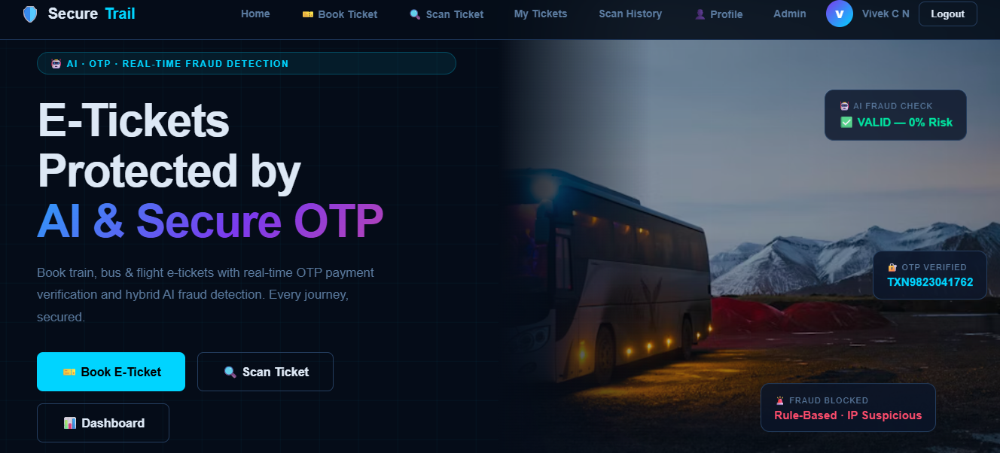
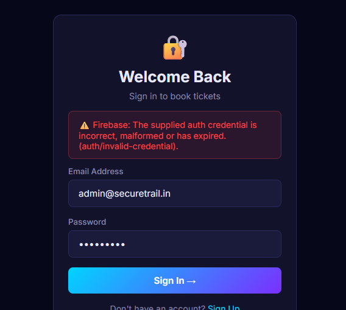
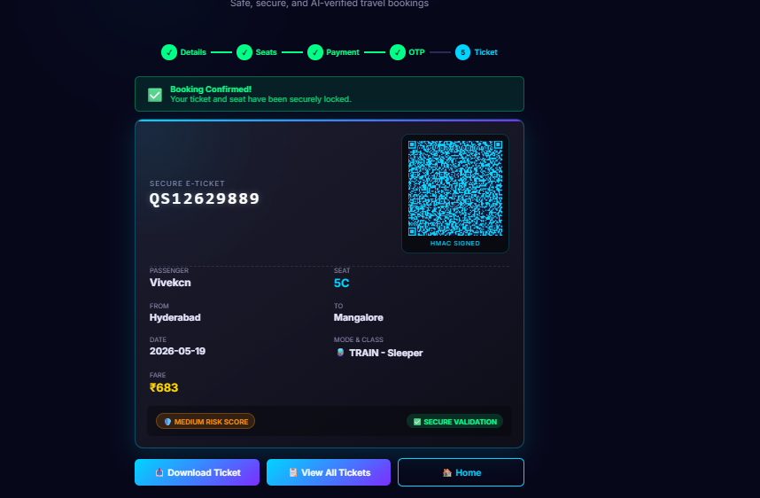
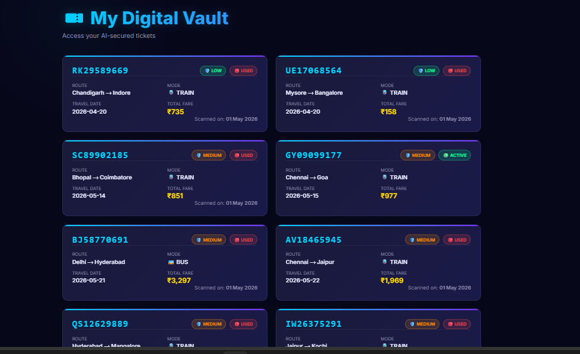

<div align="center">
  <h1>🛡️ SecureTrail AI</h1>
  <p><strong>AI-powered E-Ticket Fraud Detection System</strong></p>
  
  [](https://securetrail-ai.onrender.com)
</div>

<br>

SecureTrail is a comprehensive full-stack web application designed to combat electronic ticketing fraud through a hybrid approach: a secure OTP booking flow combined with an advanced Computer Vision (CV) and Machine Learning (ML) ticket scanner.

## 🚀 Live Application
**Try it out here:** [https://securetrail-ai.onrender.com](https://securetrail-ai.onrender.com)

---

## 📸 Screenshots

### Home Dashboard

*Modern, responsive dashboard providing real-time statistics and an overview of AI checks.*

### AI Scanner & Verdict

*Computer Vision and OCR scanning for uploaded tickets to verify QR data, PNR, EXIF metadata, and text anomalies.*

### Secure Booking Flow

*4-step OTP-verified booking process with dynamic pricing and rule-based + ML fraud scoring.*

### Digital Ticket Vault

*Real-time authenticity checks and historical tracking of all AI-secured tickets.*

*(Note: Ensure your screenshot images are placed in an `assets/` folder within this repository and named accordingly, e.g., `home.png`, `scanner.png`, `booking.png`, `vault.png`)*

---

## ✨ Core Features

### 1. OTP Booking Flow
- **4-Step Verification:** Users book tickets with a secure, time-sensitive OTP sent via email (SMTP).
- **Rule-Based Engine:** Instant checks for cancelled ticket reuse, duplicate usage, excessive bookings, and suspicious IPs/devices.
- **Decision Tree ML Model:** Secondary layer analyzing 11 features (e.g., travel distance, failure counts, device history) with **98.85% accuracy**.
- **Dynamic Pricing:** Automatically calculates realistic pricing based on hardcoded city-pair distances.

### 2. CV/OCR Ticket Scanner
- **QR & Text Verification:** Uses OpenCV and `pytesseract` to detect/decode QR codes and perform OCR on uploaded ticket images.
- **10-Point Check:** Validates PNR matching, OCR confidence, font consistency (edge density), EXIF integrity, price reasonability, and more.
- **Ensemble ML Model:** Combines GradientBoosting (70% weight, supervised) and IsolationForest (30% weight, anomaly detection) for a final fraud probability score.
- **PDF Reports:** Generates downloadable forensic PDF reports for scanned tickets using `reportlab`.

### 3. Admin Dashboard
- Live KPIs (Total Tickets, Fraud Detected, Valid, Success/Fail rates).
- Interactive Chart.js visualizations.
- One-click model retraining interface that spins up background processes to retrain the Scan ML model dynamically.

---

## 🛠️ Technology Stack

- **Backend:** Python 3.11, Flask (REST API)
- **Database:** SQLite3
- **Machine Learning:** Scikit-learn (Decision Tree, GradientBoosting, IsolationForest), Pandas, Numpy
- **Computer Vision & OCR:** OpenCV (`cv2`), Tesseract (`pytesseract`)
- **PDF Generation:** ReportLab
- **Frontend:** HTML5, Vanilla JavaScript, Custom CSS (No frameworks)
- **Charts:** Chart.js 4.4.0

---

## 💻 Local Setup & Installation

### Prerequisites
- **Python 3.9+** installed.
- **Tesseract-OCR** installed on your system (Required for the ticket scanner's OCR features).

### Steps

1. **Clone the repository:**
   ```bash
   git clone https://github.com/Vivek-CN-2004/SecureTrail-AI.git
   cd SecureTrail-AI
   ```

2. **Install dependencies:**
   ```bash
   pip install -r requirements.txt
   # OR manually: pip install flask werkzeug pandas numpy scikit-learn reportlab opencv-python pytesseract pillow
   ```

3. **Train the ML Models (if running for the first time):**
   ```bash
   cd model
   python train_model.py
   python train_scan_model.py
   cd ..
   ```

4. **Run the Application:**
   - On **Windows**: Double-click `start.bat` or run:
     ```cmd
     start.bat
     ```
   - On **Linux/Mac**: Make the script executable and run:
     ```bash
     chmod +x run.sh
     ./run.sh
     ```
   - *Alternatively, run the Flask app directly:*
     ```bash
     cd backend
     python app.py
     ```

5. **Access the Web App:**
   Open [http://localhost:5000](http://localhost:5000) in your browser.

> **Default Admin Credentials:**
> - Email: `admin@securerail.com`
> - Password: `Admin@123`

---

## 📂 Project Structure

```text
SecureTrail-AI/
├── backend/               
│   └── app.py              # Flask server, API endpoints, SQLite init
├── frontend/              
│   └── index.html          # Single Page Application (UI)
├── dataset/               
│   ├── generate_dataset.py # Generates booking fraud synthetic data
│   └── generate_scan_dataset.py # Generates CV scanner synthetic data
├── model/                 
│   ├── train_model.py      # Trains Decision Tree (Booking model)
│   ├── train_scan_model.py # Trains GB + IsolationForest (Scan model)
│   ├── fraud_model.pkl     # Compiled booking model
│   └── scan_model.pkl      # Compiled scan model
├── uploads/                # Stores user-uploaded ticket images
├── reports/                # Generated forensic PDF reports
├── database.db             # Auto-generated SQLite database
├── start.bat               # Windows launcher
└── run.sh                  # Linux/Mac launcher
```

---

<div align="center">
  <i>Built with ❤️ for secure travel.</i>
</div>
